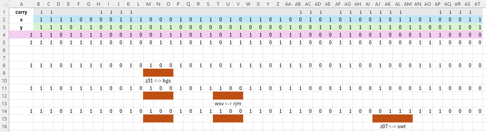

Part II solved manually, only 4 swaps need. We know the results (x + y) but had to check why z registers were different. The job was counting the index, find the full-adder and understand what was wrong.

